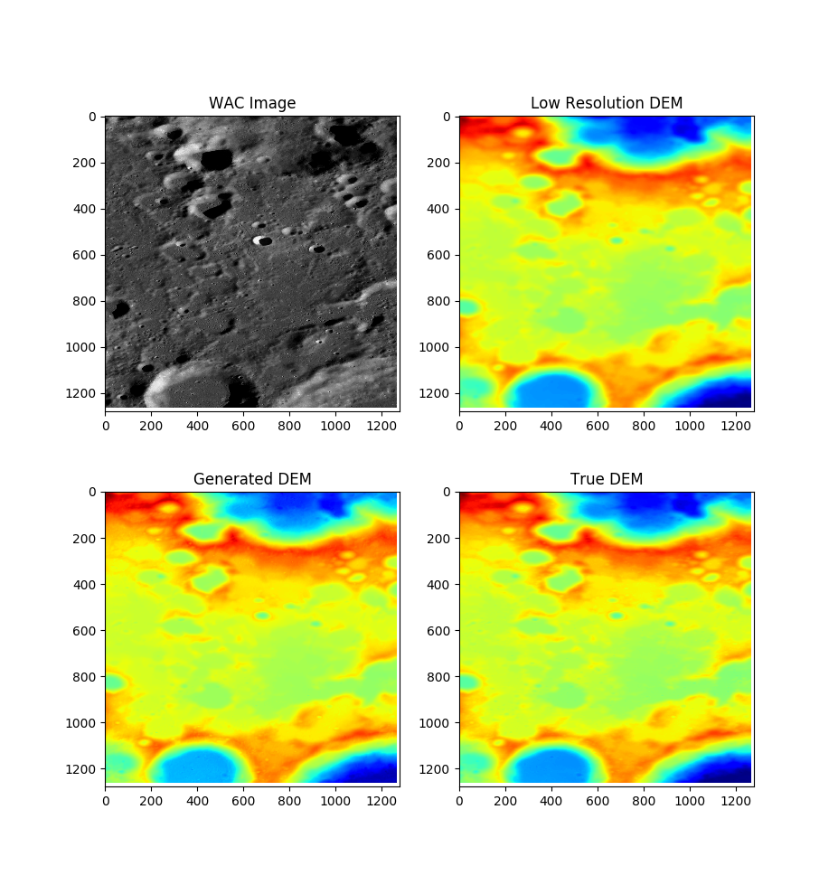
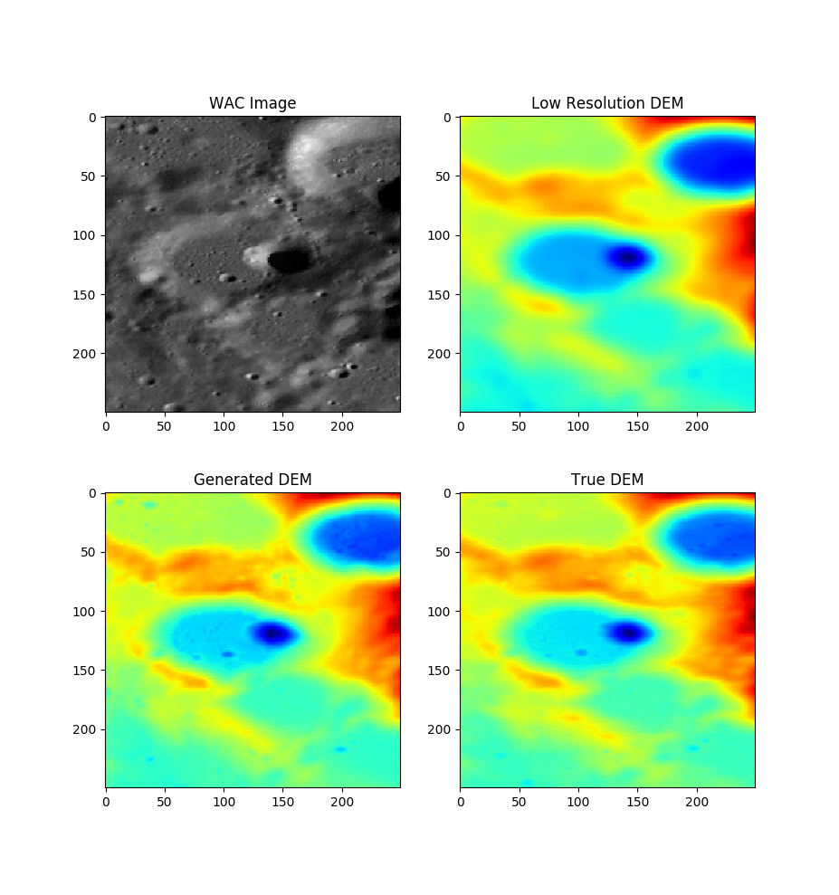

# This repository aims at teaching GANs to increase the resolution of Lunar DEMs (Digital Elevation Maps) leveraging satellite imagery (WAC from LRO).
Assembled tiles | Zoom on assembled tiles
 | 

## Downloading and formating the data
First, to download the data, run the following script. These files will take about 18Gb:\
`./get_data.sh` 

The data then needs to be reformated. These files will take an additional 3.6Gb:\
`python3 tile_WAC_MOS.py --data_path data`

The files then need to be formated into an h5 format. This will take an additional 30Gb:\
`python3 make_h5.py --data_path data --output .`

## Training
### Train pix2pix
`python3 train_pix2pix.py --path_h5 MoonORTO2DEM.hdf5 --path_trn MoonORTO2DEM_train.pkl --path_val MoonORTO2DEM_val.pkl --output_path exp_pix2pix`

### Train spade/gaugan
`python3 train_spade.py --path_h5 MoonORTO2DEM.hdf5 --path_trn MoonORTO2DEM_train.pkl --path_val MoonORTO2DEM_val.pkl --output_path exp_spade`

### Tensorboard visualization:
To visualize the progress of the training you can use the tensorboard frontend using a command similar to this one:\
`tensorboard --logdir exp_spade --bind_all`
The visualization allows to monitor the losses as well as the images generated by the network. Please note that the images are display as `jet` colormaps but the actual predicted images are normalized float32 images. An example of image visualisation can be seen below. On the first row are the targets (GT), on the second row are the input DEMs (GT down sampled by a factor 10), on the third row are the satelite images, and on the last row are the predicted images.

Sources:\
Spade: https://github.com/soumik12345/tf2_gans (Adapted to our problem, fixed encoder not learning, and added a consistency loss).\
Pix2pix: https://www.tensorflow.org/tutorials/generative/pix2pix (Reworked the network, adapted to our problem).
