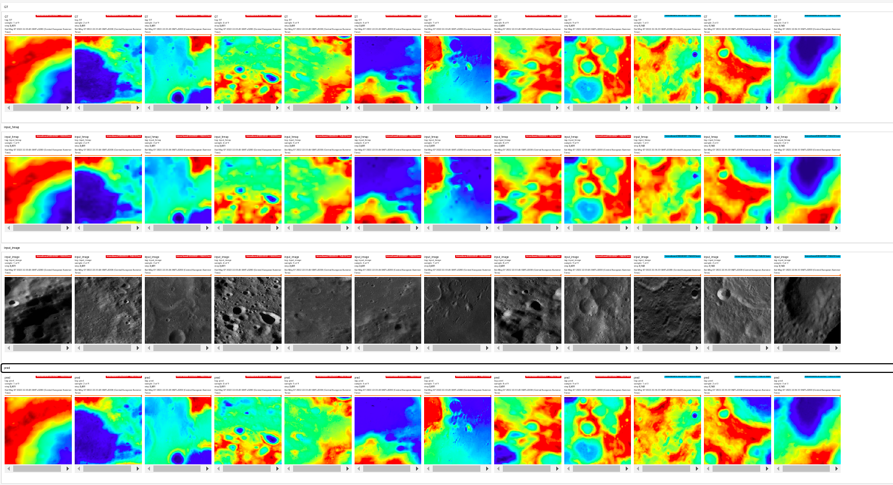

# This repository aims at teaching GANs to increase the resolution of DEMs (Digital Elevation Maps) leveraging satellite imagery

## Downloadng and formating the data
First, to download the data, run the following script. These files will take about 18Gb:\\
`./get_data.sh` 

The data then needs to be reformated. These files will take an additional 3.6Gb:\\
`python3 tile_WAC_MOS.py --data_path data`

The files then need to be formated into an h5 format. This will take an additional 30Gb:\\
`python3 make_h5.py --data_path data --output .`

## Train pix2pix
`python3 train_pix2pix.py --path_h5 MoonORTO2DEM.hdf5 --path_trn MoonORTO2DEM_train.pkl --path_val MoonORTO2DEM_val.pkl --output_path exp_pix2pix`

## Train spade/gaugan
`python3 train_spade.py --path_h5 MoonORTO2DEM.hdf5 --path_trn MoonORTO2DEM_train.pkl --path_val MoonORTO2DEM_val.pkl --output_path exp_spade`

## This code comes with a tensorboard visualization here is an example:
On the first row are the targets (GT), on the second raw are the input DEM (GT down sampled by a factor 10), on the third raw are the satelite images, and on the last row are the predicted images.

